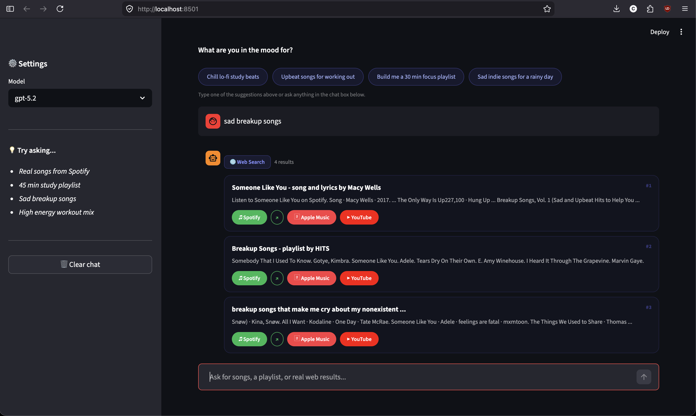
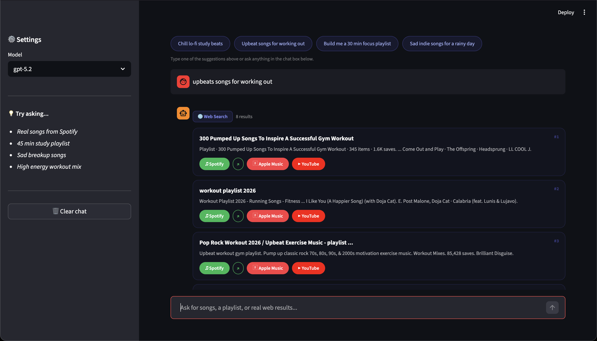
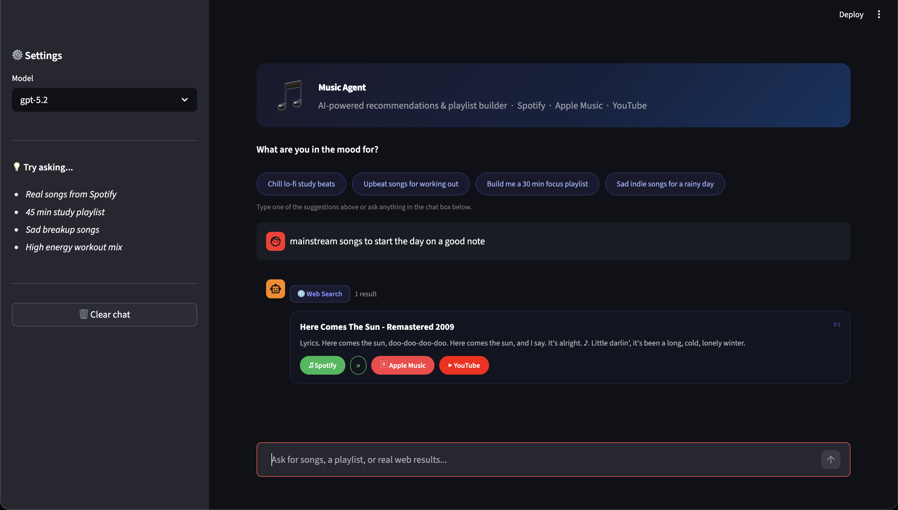

# Music Recommender Agent

**Base Project:** AI-Powered Music Discovery System — CodePath Applied AI Final Project

An AI-powered music discovery app built with a three-layer recommendation pipeline — scoring engine, RAG semantic search, and a live web agent — delivered through a Streamlit chat interface with direct links to Spotify, Apple Music, and YouTube.

**Tech stack:** Python · Streamlit · FastAPI · OpenAI Embeddings · OmniAgents · SerpAPI · NumPy · pytest

---

## Demo

**Video Walkthrough:** [Watch on Loom](https://www.loom.com/share/d02a11ac7a3b4a8aa35ebc6923dbc366)

| Query | Result |
|-------|--------|
| "sad breakup songs" | 4 deduplicated Spotify results with platform links |
| "upbeat songs for working out" | 8 gym playlist results across formats |
| "mainstream songs to start the day on a good note" | Mood-matched results like *Here Comes The Sun* |





---

## Architecture

The system layers three recommendation approaches, each independently usable:

```
┌─────────────────────────────────────────────────────┐
│                  Streamlit Chat UI                  │
└─────────────────┬───────────────────────────────────┘
                  │
         OmniAgents framework
                  │
       ┌──────────┴──────────┐
       │                     │
  web_search_songs    web_build_playlist
  (SerpAPI → Google)  (3 query variants
                       + dedup)
```

```
CLI / FastAPI only:
┌──────────────┐    ┌─────────────────────┐    ┌──────────────────────┐
│   Scoring    │ →  │    RAG Search        │ →  │  Playlist Agent      │
│   Engine     │    │  (OpenAI embeddings  │    │  (subquery decomp.   │
│ (genre/mood/ │    │  + cosine similarity │    │  + ranked assembly)  │
│   energy)    │    │  + profile rerank)   │    │                      │
└──────────────┘    └─────────────────────┘    └──────────────────────┘
```

> The Streamlit chat UI uses only the web agent path. The scoring engine, RAG layer, and `UserProfile` are exercised through the CLI and FastAPI server.

---

## Project Structure

```
streamlit_app.py              # Streamlit chat UI (primary interface)
src/
  recommender.py              # Song, UserProfile dataclasses + scoring logic
  system.py                   # Singleton wiring (lru_cache) for RAG + agent
  rag/                        # Embeddings, in-memory vector store, reranking
  agent/playlist_agent.py     # Goal → subqueries → ranked playlist assembly
  api.py                      # FastAPI REST API (/search, /playlist)
  main.py                     # CLI entry point
omniagent/
  agent.yml                   # OmniAgents config (model, tools, temperature)
  instructions.md             # Agent system prompt
  tools/
    web_song_tools.py         # SerpAPI-backed web search tools
    music_tools.py            # Local catalog tools (wraps RAG + agent)
data/songs.csv                # 18-song local catalog
docs/                         # Diagrams and screenshots
tests/                        # pytest unit tests
```

---

## Getting Started

**Prerequisites:** Python 3.10+, an OpenAI API key, a SerpAPI key

```bash
git clone <repo-url>
cd applied-ai-system-project

python -m venv .venv
source .venv/bin/activate        # Windows: .venv\Scripts\activate

pip install -r requirements.txt

cp .env.example .env             # then fill in your keys
```

**.env keys:**

| Key | Purpose | Required |
|-----|---------|----------|
| `OPENAI_API_KEY` | Text embeddings for RAG layer | No — hash fallback used if missing |
| `SERPAPI_API_KEY` | Live web search for chat agent | Yes for chat UI |

**Run the app:**

```bash
streamlit run streamlit_app.py
```

---

## Features

**Chat interface**
- Natural language queries — describe a vibe, genre, mood, or activity
- Agent automatically routes to song search or playlist builder based on phrasing
- Results deduplicated by URL (normalized, tracking params stripped) and title
- Numbered result cards with snippet previews

**Platform links**
- **Spotify** button uses the `spotify:` deep-link URI scheme — opens the desktop app directly if installed, falls back to the web player
- **Apple Music** and **YouTube** open in a new browser tab
- All links are generated per-track using the actual result URL or a targeted search fallback

**Sidebar**
- Model selector (gpt-5.2, gpt-4o, gpt-4o-mini, gpt-4.1-mini) — hot-swappable without restart
- Clear chat resets to the welcome screen with suggestion chips

---

## Other Interfaces

```bash
# CLI — local scoring engine
python -m src.main
python -m src.main search "late night coding vibes" --k 5
python -m src.main playlist "45 min study focus" --minutes 45 --unique-artist

# FastAPI (interactive docs at /docs)
uvicorn src.api:app --reload

# Tests
pytest
pytest tests/test_recommender.py -k "test_recommend"
```

---

## How the Scoring Engine Works

Songs are scored against a `UserProfile` (genre, mood, target energy, acoustic preference):

| Signal | Max points | Type |
|--------|-----------|------|
| Genre match | +1.0 | Binary |
| Mood match | +1.5 | Binary |
| Energy proximity | +4.0 | Continuous: `max(0, 4.0 - abs(song_energy - target) * 4.0)` |

The continuous energy score produces finer-grained differentiation than the binary signals, which causes energy to dominate rankings when genre and mood are tied — a known limitation detailed below.

---

## Automated Tests

The test suite contains **148 tests** across 5 files and runs in under 2 seconds with no real API calls. Every external dependency (OpenAI, SerpAPI) is mocked or replaced with a deterministic fallback so results are reproducible and do not depend on network access or API quotas.

```bash
pytest        # run all 148 tests
pytest -v     # verbose — shows each test name
pytest -x     # stop on first failure
```

### What is tested and why it proves the system works

| File | Tests | What it verifies |
|------|-------|-----------------|
| `test_recommender.py` | 27 | The scoring formula produces correct numeric output — genre match adds exactly +1.0, mood +1.5, a perfect energy match yields +4.0, a maximum miss yields 0.0. Rankings are verified to be sorted descending. The CSV loader is tested against both a temp file and the real `data/songs.csv`. |
| `test_rag.py` | 36 | The embedding layer produces normalized, deterministic, non-degenerate vectors. Cosine similarity returns 1.0 for identical vectors and 0.0 for orthogonal ones. The vector store correctly raises before indexing, respects k, and applies metadata filters. Query expansion injects genre/mood from the user profile. Reranking boosts matching songs. |
| `test_playlist_agent.py` | 34 | Subquery generation produces the correct seeds for study, workout, sleep, and generic goals with no duplicates. The assembly step enforces the unique-artist constraint, deduplicates by song ID, and respects the target track count. Title truncation caps at 48 characters. The full `PlaylistBuilderAgent` returns a valid `PlaylistPlan` with items, trace, goal, and minutes. |
| `test_web_tools.py` | 26 | URL normalization strips Spotify tracking parameters (`?si=...`), fragments, and trailing slashes so the same track is never returned twice. Title normalization catches duplicates with different casing. The k-limit is enforced. Items missing a title or link are skipped. A missing API key raises a clear error. Cross-query deduplication in `web_build_playlist_impl` is verified end-to-end with mocked HTTP responses. |
| `test_streamlit_helpers.py` | 25 | Spotify deep-link URIs are correctly extracted from track, album, playlist, and artist URLs, with tracking params stripped. Non-Spotify URLs fall back to `spotify:search:query`. All three platform buttons appear in the rendered HTML with correct `href` values. `try_parse_json` handles valid JSON, invalid JSON, empty strings, and non-string inputs. `summarize_tool_payload` correctly classifies web search vs. playlist tool outputs. |

### How the tests prove the AI system is reliable

**Scoring is deterministic and auditable.** The tests pin the exact numeric output of `score_song` for known inputs, making it impossible for the ranking logic to silently change behavior without a test failure.

**The RAG pipeline works without an API key.** The `conftest.py` fixture replaces `embed_texts` with the hash-based fallback for every test. This proves the full pipeline — indexing, searching, filtering, reranking, and explanation generation — functions correctly without any external service dependency.

**Deduplication is verified against the exact bug that was found.** The URL normalization tests use Spotify URLs with real `?si=` tracking parameters to confirm the fix that prevented the same track from appearing multiple times in results.

**No test relies on live network calls.** `requests.get` is mocked in all web tool tests, meaning results are stable across runs regardless of SerpAPI availability, rate limits, or changes in Google search results.

**Edge cases are explicitly covered.** Empty inputs, k larger than the catalog, songs missing titles or links, goals with only whitespace, and orthogonal embedding vectors are all tested — these are the conditions most likely to produce silent failures in production.

---

## Design Decisions & Trade-offs

**Three independent layers instead of one monolithic pipeline**
Each layer — scoring, RAG, web agent — can be run and evaluated independently. This made it straightforward to isolate where results were coming from and where the formula was failing. The cost is loose coupling: the Streamlit UI only uses the top layer and bypasses everything built beneath it.

**In-memory vector store over a hosted service**
The RAG layer uses cosine similarity on NumPy arrays rather than Pinecone or Weaviate. The index is rebuilt on startup from the local catalog. This keeps the project fully self-contained with no external infrastructure, at the cost of scalability — it works fine at 18 songs, would not work at 100k.

**Hash-based embedding fallback**
When no OpenAI key is present, the RAG layer falls back to a deterministic hash-based embedding so the app still runs. The fallback has no semantic understanding — "sad" and "melancholy" are unrelated vectors — but it allows the pipeline to be tested end-to-end without a paid API.

**SerpAPI over Spotify's native API**
One SerpAPI key surfaces results across Spotify, Apple Music, YouTube, and general web without requiring an OAuth flow. The trade-off is that results depend on what Google surfaces, which varies by phrasing and can return playlist pages or article listicles instead of individual tracks.

**OmniAgents for tool routing**
The language model decides whether to call `web_search_songs` or `web_build_playlist` based on the user's phrasing, rather than hand-written routing logic. This handles ambiguous phrasing gracefully but removes control — if the model misreads intent, there is no fallback, and the agent cannot combine both tools in a single response.

**Energy weight intentionally high**
Energy proximity is scored on a continuous 0–4.0 scale while genre and mood are binary 0/1 signals. This was chosen to produce more differentiation between songs that share the same genre or mood, at the cost of energy overwhelming the other signals in edge cases.

---

## Known Limitations

| Limitation | Impact |
|-----------|--------|
| Energy dominates scoring | A wrong-genre, wrong-mood song with close energy outranks a right-genre, right-mood song with slightly off energy |
| `likes_acoustic` unused | Collected in `UserProfile`, passed through the code, never read by `score_song` |
| 18-song local catalog | Some genres missing entirely; rare edge-case profiles get poor matches simply because nothing better exists |
| No lyric or audio understanding | Recommendations are metadata-only — genre, mood, energy labels assigned manually |
| No session memory | Each conversation starts fresh with no history of past preferences |
| Chat UI bypasses personalization | `UserProfile` and the scoring engine only apply via CLI/API; the chat app has no concept of a stored user profile |

---

## Testing & Findings

**What held up under testing**

The scoring engine performed well when all three user profile signals aligned — the "Late Night Coding" profile (lofi, focused, low energy 0.40) returned consistently appropriate results because genre, mood, and energy all pointed at the same small set of songs.

The RAG layer handled vague natural language better than the scoring engine alone. Query expansion bridged terminology gaps between how users describe music ("coding vibes") and how the catalog describes it ("focused, lofi").

The web agent's tool routing was reliable. Queries phrased as song searches called `web_search_songs`; queries mentioning playlists or durations called `web_build_playlist`.

**What failed and how it was diagnosed**

*Energy dominance* — Testing the "Happy Chill Pop" profile (pop, happy, energy 0.76) surfaced a gym song labeled "intense" in the top 3. The score breakdown showed it earning 3.32 energy points (+1.0 genre = 4.32 total), beating a better mood match. This identified the weight imbalance as a design flaw rather than a bug.

*Spotify deep-link blocked by iframe* — The initial implementation used `window.location.href = 'spotify:...'` in a JavaScript onclick. This failed silently because browsers block custom URI scheme navigations from inside iframes. Diagnosed by inspecting browser dev tools. Fixed by using a direct `href="spotify:..."` anchor, which browsers delegate to the OS regardless of iframe context.

*Duplicate results* — The same Spotify track was appearing multiple times. Root cause: Spotify URLs include session tracking parameters (`?si=...`) that differ per request, so URL equality checks saw them as different tracks. Fixed by normalizing URLs (stripping query params and fragments) before deduplication, and adding a secondary title-based dedup pass.

*CSS entirely non-functional* — All card and button styles were missing from the rendered UI. Root cause: every line of the `<style>` block had a leading `+` character from a diff/patch artifact, making the opening tag `+<style>` — invalid HTML the browser silently ignored. Fixed by removing the prefix characters.

**Key takeaway**

The gap between what a system is *designed* to do and what users actually *experience* through the interface can be large. Most of the personalization and ranking work in this project is invisible to anyone using the chat UI. Integration matters as much as implementation.

---

## Responsible AI

### Limitations and biases in the system

The most significant bias is **energy dominance**. The scoring formula awards up to +4.0 points for energy proximity versus +1.0 for genre and +1.5 for mood. In practice this means a song with the wrong genre and wrong mood can outrank a song with the right genre and right mood, purely because its energy value is numerically close to the target. Users have no visibility into this — they see a ranked list but not the weights driving it. This is the same kind of hidden bias that exists in production recommenders on real streaming platforms, just made visible here at small scale.

A second bias is **catalog underrepresentation**. The 18-song local catalog has no classical or metal songs at all. A user who prefers those genres will always receive poor matches from the scoring and RAG layers — not because the algorithm fails, but because the data was never collected. Biased data produces biased outputs even when the algorithm itself is correct.

A third issue is the **unused `acousticness` field**. The system collects an acoustic preference from the user, stores it in the `UserProfile`, and passes it through the code — but never uses it in scoring. A user who explicitly says they like acoustic music receives the same recommendations as one who does not. The system implies a capability it does not have.

### Could this AI be misused, and how would it be prevented?

The web agent searches Google via SerpAPI and returns whatever results surface — including links to pirated content, unofficial uploads on YouTube, or misleading song titles. A user could also craft queries designed to surface harmful or offensive content by phrasing them in ways the search filters do not catch.

Preventions that would matter in a production version:
- **Domain allowlisting** — only return links from trusted domains (open.spotify.com, music.apple.com, youtube.com) and discard everything else.
- **Query filtering** — reject or sanitize prompts that contain known harmful patterns before passing them to the search API.
- **Result filtering** — score returned snippets for inappropriate content before rendering them in the UI.

In the current version, none of these are implemented. The app is scoped to personal or demonstration use where the user controls their own queries.

### What surprised me while testing the AI's reliability

The most surprising finding was that a bug could be **completely invisible in code review but immediately obvious when you run the app**. The `<style>` block in the Streamlit UI had a `+` character at the start of every line — a leftover from a diff/patch format — which made the entire stylesheet invalid. No Python error was raised, no test failed, the app launched without warnings, but every card and button in the UI rendered as unstyled plain HTML. The only way to catch it was to look at the running app. This was a reminder that type checkers and linters cannot verify visual output.

The second surprise was how the Spotify deep-link behaved differently depending on context. A `spotify:` URI in a standard `<a href>` works correctly and opens the desktop app. The same URI passed to `window.location.href` inside JavaScript fails silently when the code runs inside an iframe — which is exactly how Streamlit renders HTML. Both approaches look correct in isolation. The difference only becomes apparent at the interface between the browser, the iframe sandbox, and the OS URI handler.

### Collaboration with AI during this project

This project was built with Claude Code as a coding assistant throughout. The collaboration covered debugging, writing tests, fixing the UI, refactoring the README, and reorganizing the project structure.

**One instance where the AI gave a helpful suggestion:**
When writing the test suite, Claude suggested using a single `autouse` pytest fixture in `conftest.py` to patch `embed_texts` with the hash-based fallback for every test automatically. This was genuinely useful — it meant no individual test file needed its own mock setup, the real fallback logic was used instead of a fake stub, and every test automatically ran without any OpenAI API dependency. Without that suggestion the tests would either have needed repetitive patch decorators everywhere or would have required a live API key to run.

**One instance where the AI's suggestion was flawed:**
The first implementation of the Spotify "open in app" button used a JavaScript onclick handler that called `window.location.href = 'spotify:...'` to navigate to the custom URI scheme, with a timeout fallback to open the web URL. This approach is standard practice for web apps and looks correct on paper. But it failed silently in Streamlit — browsers block custom URI scheme navigations that originate from JavaScript inside an iframe, which is how Streamlit renders all HTML content. The button appeared to work (something happened when clicked) but always ended up opening the website instead of the app. The fix required understanding the iframe sandbox restriction and switching to a plain `href="spotify:..."` anchor, which browsers handle at the OS level regardless of iframe context. The AI's initial suggestion was not wrong in general — it was wrong for this specific environment.

---

## Reflection

**Scoring weights are product decisions, not just math.** Choosing energy at 4.0 vs. genre at 1.0 was a statement about what matters in music recommendations — made implicitly, without realizing it at the time. The consequence was a system that consistently steered users toward energy-matching songs regardless of mood or genre, with no way for users to know that was happening. Production recommendation systems work the same way: every weight encodes a value judgment about what to optimize for, and those judgments compound at scale.

**Collecting a feature you don't use is worse than not collecting it.** The `acousticness` field exists in the data, appears in the `UserProfile` dataclass, and is passed through the call stack — but `score_song` never reads it. A user asking for acoustic folk songs gets jazz and lofi results, and has no way to know the system was ignoring their stated preference. This is a harder failure than a missing feature because it creates false expectations. Either use what you collect, or be explicit about why you don't.

**Adding layers adds surface area, not necessarily capability.** The project grew from a scoring formula to a RAG pipeline to a web agent, but the chat UI — where all of that work is supposed to pay off — only uses the last layer. The earlier layers are fully functional but effectively invisible to users. The engineering lesson is that integration work is as load-bearing as feature work, and it's easier to skip.
